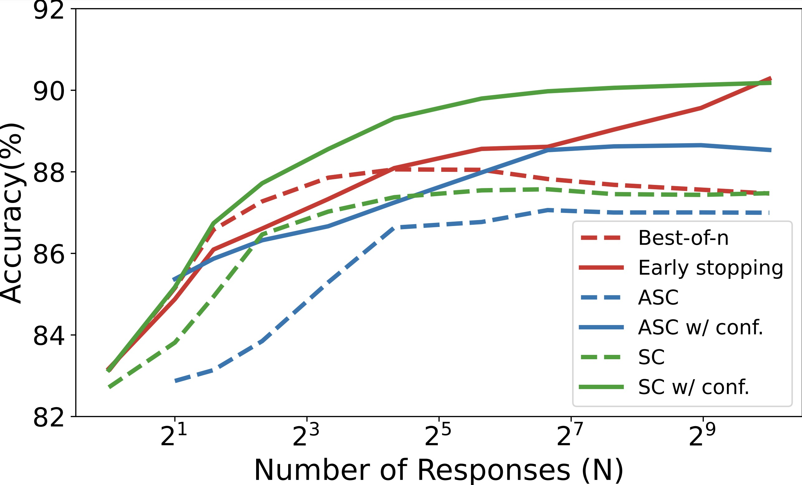

# Efficient Test-Time Scaling via Self-Calibration

The official repository which contains the code and pre-trained models/datasets for our paper ```Efficient Test-Time Scaling via Self-Calibration```. 
# 🔥 Updates
- [**2025-2-20**]: We released our codes, models and datasets.

# 🏴󠁶󠁵󠁭󠁡󠁰󠁿 Overview

We propose a new framework, Self-Calibration, that can make model generate calibrated confidence score. 
<br>
<figure style="text-align:center">
  
</figure>
Illustration of the Self-Calibration framework. Given a query from the seed dataset, we sample $N$ responses from the LLM. We use a confidence querying prompt to let LLM assign a confidence score to each response. Responses are then grouped by their answers, and the Soft Self-Consistency (SSC) score is computed for each group. During training, all data tuples contribute to improving the model's calibration, while higher-confidence data is used to enhance the LLM's generation ability.
<br>
<figure style="text-align:center">
  
</figure>
At test time, we design efficient test-time scaling strategies using these calibrated confidence scores, such as early stopping for Best-of-N when sampled responses reach a target confidence, and Self-Consistency weighted by reliable confidence.


# ⚡️ Quickstart

## Installation
```bash
conda create -n Self-Calibration python=3.10
conda activate Self-Calibration
pip install -r requirements.txt
pip install vllm -U

```
## Usage

### Data_Creation
The dynamic temperature version is quite slow. You can also use non-dt version by change `data_generator_dt` to `data_generator` in `data_gen.bash`.
```bash
bash scripts/data_gen.bash \
    meta-llama/Llama-3.1-8B-Instruct \
    0.8 \ # temperature
    "--use_cot" \
    32 \ # number of generation
    "train" \
    100 \ # number of samples in each dataset
    "llama" #saving path
```

### Model Training
```bash
# trianing details should be written in model_training/configs/{config_name}.json
bash scripts/main.bash \
    ./models/llama \ # save path
    config_name \ # config path
    meta-llama/Llama-3.1-8B-Instruct # basemodel
```

### Evaluation
```bash
bash scripts/evaluate.bash \
    model_path \
    task_name \
    generation_number \
```
### Add New Datasets or New m=Models
If you want to add a new dataset for data generation or test, you should update the `utils/dataset_loader.py` to implement a new dataset handler
<details>

  <summary> Click to expand </summary>

```python
class DatasetHandler(ABC):
    @abstractmethod
    def load_data(self):
        """
        Load the dataset and return a tuple: (splits_dict, answer_type).

        splits_dict: A dictionary where each key is a split name (e.g., 'train', 'test')
                     and the value is the corresponding dataset or data structure.
        answer_type: A string describing the type of the answer, e.g.:
                     'number', 'text', 'option letter', etc.
        """
        pass
    
    @abstractmethod
    def prepare_qa_data(self, data):
        """
        Given a particular split (like a list or IterableDataset),
        transform it into a dictionary: {prompt_text -> ground_truth_answer}.
        """
        pass

    @abstractmethod
    def extract_answer(self, response):
        """
        Given a model-generated response (string), extract the final answer
        so that it matches the ground truth format (number, letter, text, etc.).
        """
        pass

    def check(self, correct_answer, response):
        """
        Given the correct answer and the model-generated response,
        check if the response is correct. This is a simple equality check.
        """
        return correct_answer == response
```
</details>

and add the name of the datasets in function `get_dataset`

For new models, you should update the `utils/SPECIAL_SUFFIXS.py` to add a new `SPECIAL_SUFFIXS` and `split_marker`.


# 🌲 Project Structure
```bash
Self-Calibration
│── data_creation # codes for data generation
│   ├── data_generator_dt.py # data generator with dynamic temperature
│   ├── data_generator.py # data generator without dynamic temperature
│   ├── dataset_creat.py # create datasets from output responses
│   ├── dt_generator.py # implement of dynamic temperature
│
│── evaluation
│   ├── analysis.py # implement of different inference methods
│   ├── calculate_confidence.py # confidences generate
│   ├── generate_responses.py # responses generate
│   ├── llama_reward.py # ORM example
│   ├── PRM_reward_score.py # PRM example
│
│── model_training
│   ├── configs/  # model training configs
│   ├── merge_lora_model.py # model merging and upload
│   ├── train.py # training scripts
│
│── utils
│   ├── dataset_loader.py # dataset loader
│   ├── metric.py # evaluation metric
│   ├── SPECIAL_SUFFIXS.py # model configs (confidence querying prompts)
│
```
# 🏰 Resource
We opensource our datasets and models on the [huggingface](https://huggingface.co/collections/HINT-lab/self-calibration-67b609d9b50275dbeeb37541).

## Models
- [DeepSeek-R1-Distill-Qwen-1.5B-Self-Calibration](https://huggingface.co/HINT-lab/DeepSeek-R1-Distill-Qwen-1.5B-Self-Calibration)
- [Qwen2.5-7B-Instruct-Self-Calibration](https://huggingface.co/HINT-lab/Qwen2.5-7B-Instruct-Self-Calibration)
- [Llama-3.1-8B-Instruct-Self-Calibration](https://huggingface.co/HINT-lab/Llama-3.1-8B-Instruct-Self-Calibration)

## Datasets
- [DeepSeek-R1-Distill-Qwen-1.5B](https://huggingface.co/datasets/HINT-lab/DeepSeek-R1-Distill-Qwen-1.5B-Self-Calibration)
- [Qwen2.5-7B-Instruct](https://huggingface.co/datasets/HINT-lab/Qwen2.5-7B-Instruct-Self-Calibration)
- [Llama_3.1-8B-Instruct](https://huggingface.co/datasets/HINT-lab/Llama_3.1-8B-Instruct-Self-Calibration)

<!-- # 💬 Citation -->