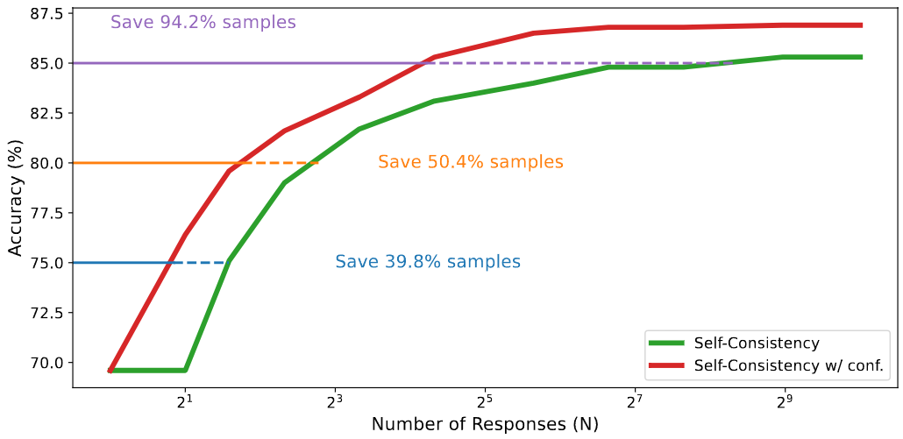
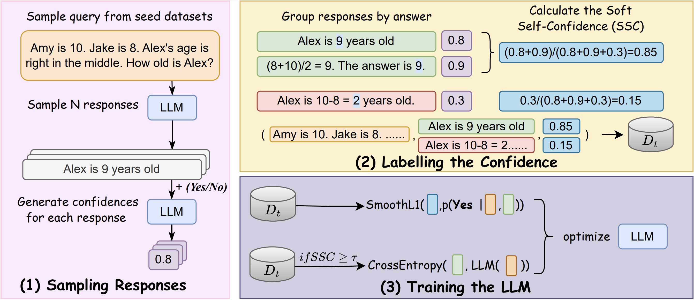

# Efficient Test-Time Scaling via Self-Calibration

The official repository which contains the code and pre-trained models/datasets for our paper ```Efficient Test-Time Scaling via Self-Calibration```. 
# 🔥 Updates
- [**2025-2-25**]: We released our codes, models and datasets.

# 🏴󠁶󠁵󠁭󠁡󠁰󠁿 Overview
<!-- We propose a new framework, Self-Calibration, that can make model generate calibrated confidence score.  -->
We propose an efficient test-time scaling method by using model confidence for dynamically sampling adjustment, since confidence can be seen as an intrinsic measure that directly reflects model uncertainty on different tasks. For example, we can incorporate the model’s confidence into self-consistency by assigning each sampled response $y_i$ a confidence score $c_i$. Instead of treating all responses equally, we perform a **weighted** aggregation as follows:

$$
y = \arg\max_{z}\sum_{i=1}^{N} c_i \mathbf{1}{(y_i = z)}
$$

where $c_i$ reflects the confidence of the $i$-th response, and $\mathbf{1}(y_i = z)$ is an indicator function that equals 1 if $y_i = z$ and 0 otherwise. This way, responses with higher confidence have a greater influence on the final answer. Or we can also apply confidence to other test-time scaling methods like best-of-N. The details can be found in our paper.

<br>
<figure style="text-align:center">
  
</figure>
 As shown in the previous figure, our approaches can achieve comparable performance with substantially fewer computational resources. The confidence-weighted Self-Consistency can save 94.2% samples to achieve an accuracy of 85.0, compared to standard Self-Consistency, demonstrating that reliable confidence estimation can significantly enhance the computational efficiency of test-time scaling.
<br><br>
However, extracting accurate confidence can be challenging since vanilla LLMs are known to be overconfident on their own responses and their confidence often exceeds the actual accuracy.

Hence, we propose a new framework, Self-Calibration, that can make model generate calibrated confidence score. 
<br>
<figure style="text-align:center">
  
</figure>
Here is the illustration of the Self-Calibration framework. Given a query from the seed dataset, we sample N responses from the LLM. We use a confidence querying prompt to let LLM assign a confidence score to each response. Responses are then grouped by their answers, and the Soft Self-Consistency (SSC) score is computed for each group. During training, all data tuples contribute to improving the model's calibration, while higher-confidence data is used to enhance the LLM's generation ability.


# ⚡️ Quickstart

## Installation
```bash
conda create -n Self-Calibration python=3.10
conda activate Self-Calibration
pip install -r requirements.txt
pip install vllm -U

```
## Usage

### Sampling Methods
To use an (efficient) sampling method, you may use
```python
inference = SampleInference(
    model_name=model_name,
    eos_token_str=eos_token_str,
    I=I,
    torch_dtype=torch.float16,
    device_map="auto"
)
```
to start an inference engine, and you may use
```python
result = inference.run_inference_interactive(
                query=prompt,
                method=method, #["earlyexit", "asc_conf", "asc", "sc", "sc_conf", "best_of_n"]
                threshold=0.7, # threshold in earlyexit, asc and asc_conf
                max_samples=16, # the number of sampling times in sc, sc_conf and best_of_n. These number is also the max sample times in earlyexit, asc and asc_conf
                temperature=0.8,
                extract_handler=dataset_handler
            )
```

The example codes can be used by 
```bash
python sampling_methods/sample.py --use_cot --model_name HINT-lab/Llama_3.1-8B-Instruct-Self-Calibration --dataset_name gsm8k
```

### Data_Creation
You can generate the data by the following scripts,
```bash
bash data_gen.bash \
  --model_name "meta-llama/Llama-3.1-8B-Instruct" \
  --temperature 0.8 \
  --use_cot_flag "--use_cot" \
  --num_generations 32 \
  --subset "train" \
  --data_size 100 \
  --save_path "llama"
```
Also, you can use the default settings by 
```
bash data_gen.bash
```
The dynamic temperature version is quite slow. You can may use non-dt version by change `data_generator_dt` to `data_generator` in `data_gen.bash`, which is more faster but the responses are possibly less diverse. 

### Model Training
```bash
# training details should be written in model_training/configs/{version}.json
bash scripts/main.bash \
  --merged_model_path "./models/llama" \
  --version "llama" \
  --basemodel "meta-llama/Llama-3.1-8B-Instruct"
```

### Evaluation
```bash
bash scripts/evaluate.bash \
    --model "meta-llama/Llama-3.1-8B-Instruct" \
    --answer_folder "example" \
    --num_generations 16 \
```

### Add New Datasets or New Models
If you want to add a new dataset for data generation or test, you should update the `utils/dataset_loader.py` to implement a new dataset handler
<details>

  <summary> Click to expand </summary>

```python
class DatasetHandler(ABC):
    @abstractmethod
    def load_data(self):
        """
        Load the dataset and return a tuple: (splits_dict, answer_type).

        splits_dict: A dictionary where each key is a split name (e.g., 'train', 'test')
                     and the value is the corresponding dataset or data structure.
        answer_type: A string describing the type of the answer, e.g.:
                     'number', 'text', 'option letter', etc.
        """
        pass
    
    @abstractmethod
    def prepare_qa_data(self, data):
        """
        Given a particular split (like a list or IterableDataset),
        transform it into a dictionary: {prompt_text -> ground_truth_answer}.
        """
        pass

    @abstractmethod
    def extract_answer(self, response):
        """
        Given a model-generated response (string), extract the final answer
        so that it matches the ground truth format (number, letter, text, etc.).
        """
        pass

    def check(self, correct_answer, response):
        """
        Given the correct answer and the model-generated response,
        check if the response is correct. This is a simple equality check.
        """
        return correct_answer == response
```
</details>

and add the name of the datasets in function `get_dataset`

For new models, you should update the `utils/SPECIAL_SUFFIXS.py` to add a new `SPECIAL_SUFFIXS` and `split_marker`.


# 🌲 Project Structure
```bash
Self-Calibration
│── data_creation # codes for data generation
│   ├── data_generator_dt.py # data generator with dynamic temperature
│   ├── data_generator.py # data generator without dynamic temperature
│   ├── dataset_creat.py # create datasets from output responses
│   ├── dt_generator.py # implement of dynamic temperature
│
│── evaluation
│   ├── analysis.py # implement of different inference methods
│   ├── calculate_confidence.py # confidences generate
│   ├── generate_responses.py # responses generate
│   ├── llama_reward.py # ORM example
│   ├── PRM_reward_score.py # PRM example
│
│── model_training
│   ├── configs/  # model training configs
│   ├── merge_lora_model.py # model merging and upload
│   ├── train.py # training scripts
│
│── utils
│   ├── dataset_loader.py # dataset loader
│   ├── metric.py # evaluation metric
│   ├── SPECIAL_SUFFIXS.py # model configs (confidence querying prompts)
│
```
# 🏰 Resource
We opensource our datasets and models on the [huggingface](https://huggingface.co/collections/HINT-lab/self-calibration-67b609d9b50275dbeeb37541).

## Models
- [DeepSeek-R1-Distill-Qwen-1.5B-Self-Calibration](https://huggingface.co/HINT-lab/DeepSeek-R1-Distill-Qwen-1.5B-Self-Calibration)
- [Qwen2.5-7B-Instruct-Self-Calibration](https://huggingface.co/HINT-lab/Qwen2.5-7B-Instruct-Self-Calibration)
- [Llama-3.1-8B-Instruct-Self-Calibration](https://huggingface.co/HINT-lab/Llama-3.1-8B-Instruct-Self-Calibration)

## Datasets
- [DeepSeek-R1-Distill-Qwen-1.5B](https://huggingface.co/datasets/HINT-lab/DeepSeek-R1-Distill-Qwen-1.5B-Self-Calibration)
- [Qwen2.5-7B-Instruct](https://huggingface.co/datasets/HINT-lab/Qwen2.5-7B-Instruct-Self-Calibration)
- [Llama_3.1-8B-Instruct](https://huggingface.co/datasets/HINT-lab/Llama_3.1-8B-Instruct-Self-Calibration)

<!-- # 💬 Citation -->